# 🌟 **Flutter Projects Repository**

Bu depo, **Flutter** ile geliştirilmiş farklı projeleri içermektedir. Her proje, belirli bir özelliği sergilemek veya yazılım geliştirme becerilerini göstermek amacıyla tasarlanmıştır. Yeni başlayanlardan ileri düzey geliştiricilere kadar herkes için öğretici ve faydalı bir koleksiyon sunmayı hedefliyorum.

---

## 📁 **Projeler**

### 1️⃣ **My ToDo App**
- **Açıklama:** Bu uygulama, kullanıcıların yapılacaklar listesini kolayca yönetmelerini sağlıyor. Görev ekleme, silme ve tamamlanmış görevleri işaretleme gibi özelliklerle günlük işlerinizi organize etmenize yardımcı oluyor. 
- **Özellikler:**
 • 🛠 State Management: Uygulamanın akışını düzenlemek için Provider kullanarak durumu yönettim.
 • 🛢 SQLite Entegrasyonu: Kullanıcıların görevlerini SQLite üzerinde saklayarak veri yönetimi sağladım.
 • 🎨 Responsive Tasarım: Farklı ekran boyutlarına uyum sağlayan dinamik ve kullanıcı dostu bir arayüz tasarladım.
 • 📅 Görev Yönetimi: Görev ekleme, silme ve tamamlama işlemleri için pratik bir yapı geliştirdim.
 • 🎯 Splash Ekranı: Şık bir splash ekranıyla kullanıcıları karşıladım, uygulamaya profesyonel bir başlangıç ekledim.
 • 🔒 Kullanıcı Kimlik Doğrulama (Firebase Auth): Kullanıcı giriş işlemlerini Firebase Authentication ile güvence altına aldım.
 • 🖼 Launcher Icons: Uygulamayı daha çekici hale getirmek için özel ikonlar tasarlayarak uygulamanın başlangıç simgesini kişiselleştirdim.
- **Klasör:** [Todo App/](./todo_sqlite/)
- **Ekran Görüntüleri:**
<div align="center">
  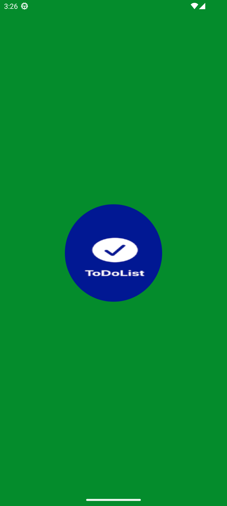
  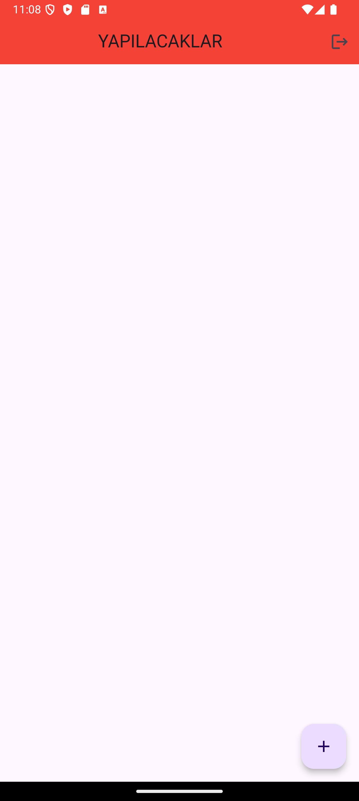
  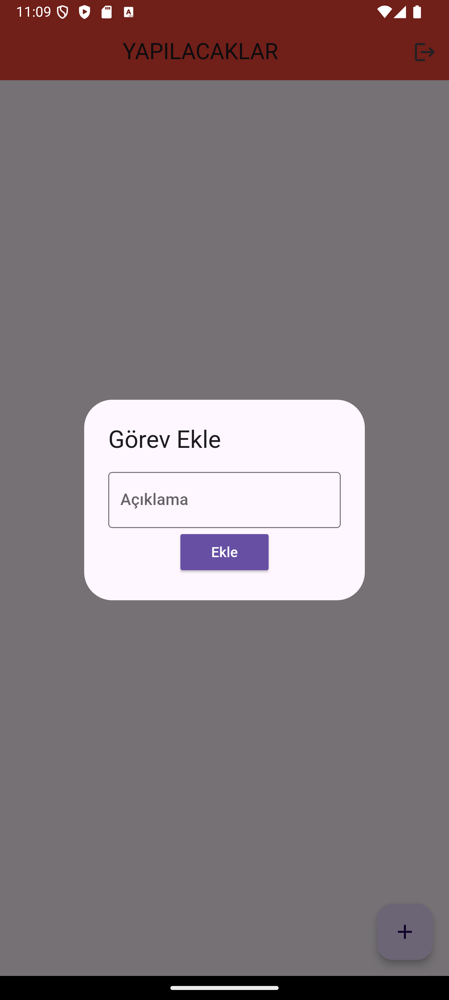
  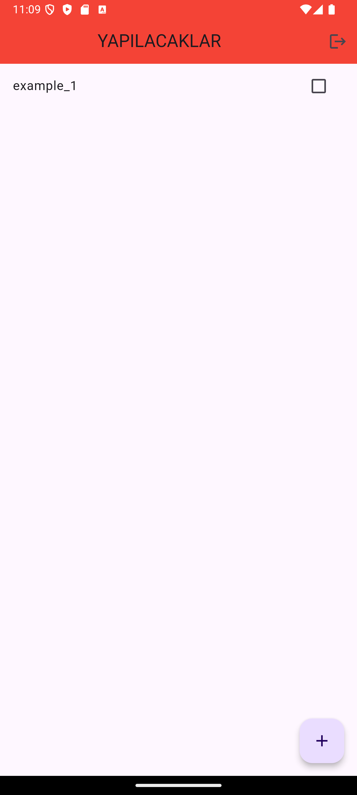
  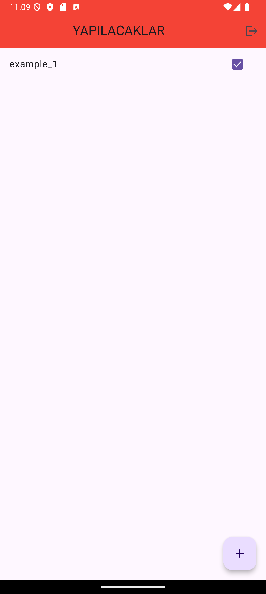
</div>

---

### 2️⃣ **Portfoy Webview**
- **Açıklama:** Geliştirici olarak geçirdiğim zaman boyunca birçok proje üzerinde çalıştım ve bu deneyimlerimi sergilemek için Flutter kullanarak geliştirdiğim portföy sitemi yayınladım.
- **Özellikler:**
  • Responsive Tasarım: Farklı ekran boyutlarına uyum sağlayarak, her cihazda mükemmel bir deneyim sunuyor.
  • Hızlı Yükleme Süreleri: Flutter'ın performans avantajı sayesinde kullanıcıların sitede hızlıca gezinmesini sağlıyor.
  • Kullanıcı Dostu Arayüz: Basit ve şık tasarım ile kullanıcı deneyimini ön planda tutuyorum.
- **Klasör:** [Portfolio/](./webview/)
- **Ekran Görüntüleri:**
<div align="center">
  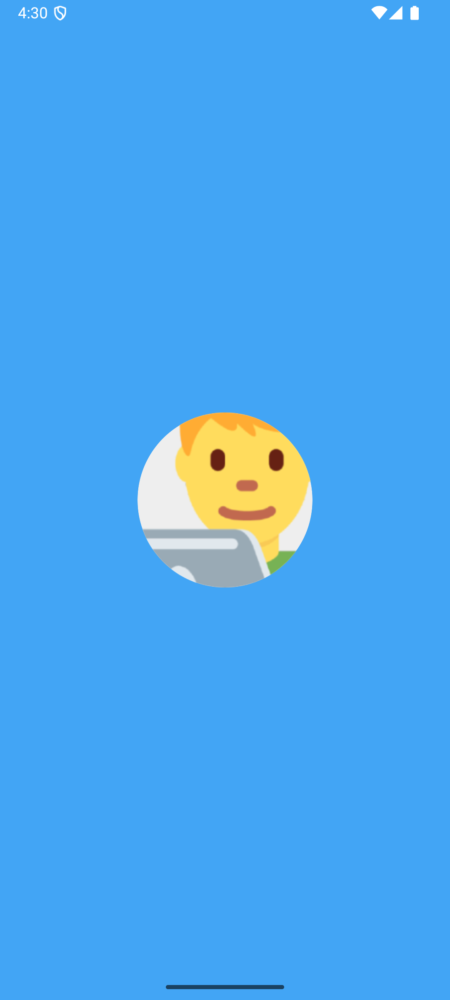
  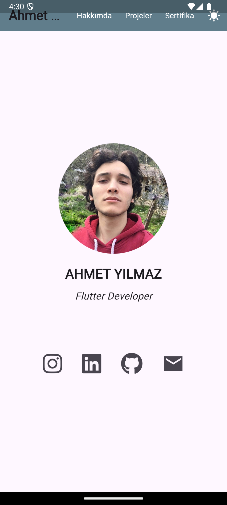
  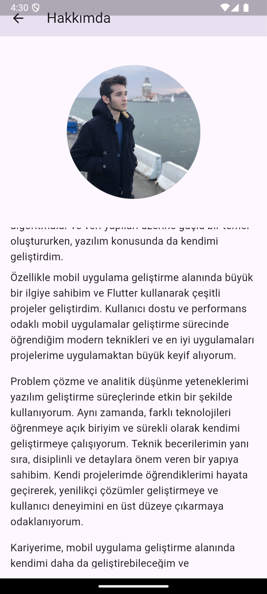
  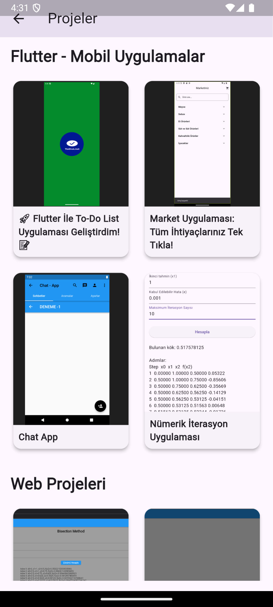
</div>

---

### 3️⃣ **Login - Register Page**
- **Açıklama:** Uygulama kullanıcı giriş ve kayıt ol sayfaları oluşturma 
- **Özellikler:**
  • Responsive Tasarım: Farklı ekran boyutlarına uyum sağlayarak, her cihazda mükemmel bir deneyim sunuyor.
  • Kullanıcı Dostu Arayüz: Basit ve şık tasarım ile kullanıcı deneyimini ön planda tutuyorum.
- **Klasör:** [Login - Register/](./loginekrani_app/)
- **Ekran Görüntüleri:**
<div align="center">
  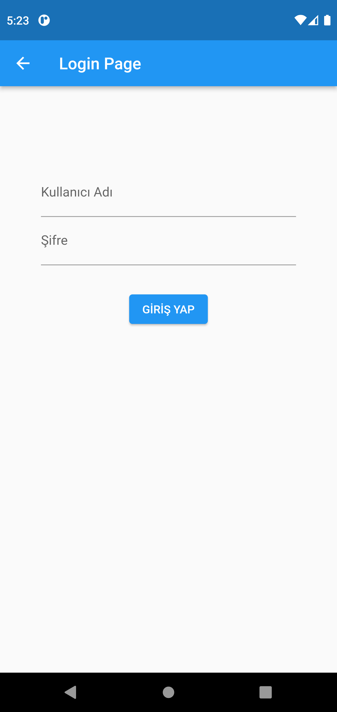
  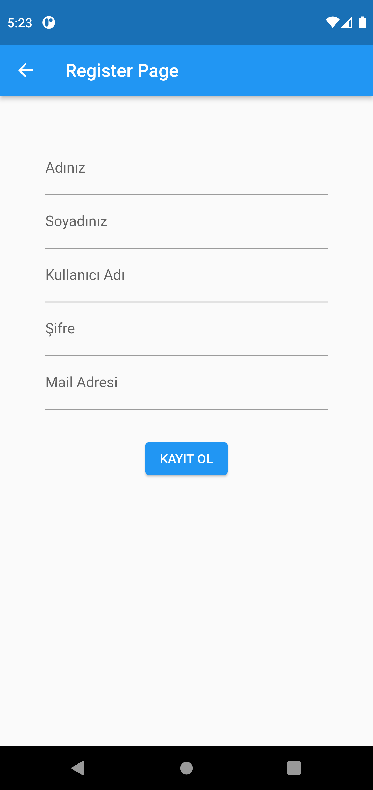
  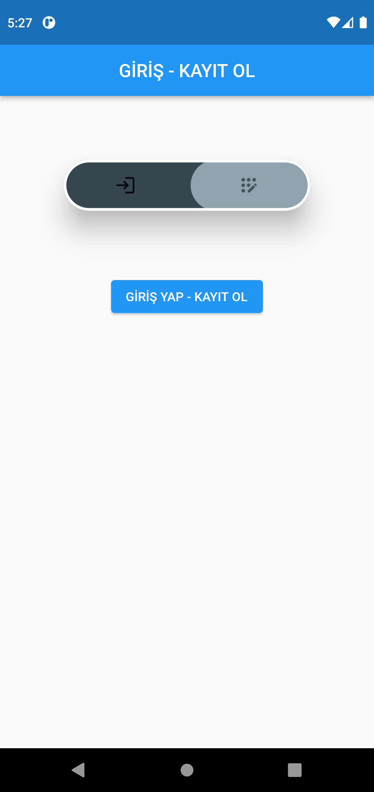
</div>

---

## 🔧 **Nasıl Çalıştırılır?**
Projeyi kendi bilgisayarınızda çalıştırmak için aşağıdaki adımları takip edebilirsiniz:

1. Bu depoyu klonlayın:
   ```bash
   git clone https://github.com/Ahmetyilmazz/Flutter_Apps.git
